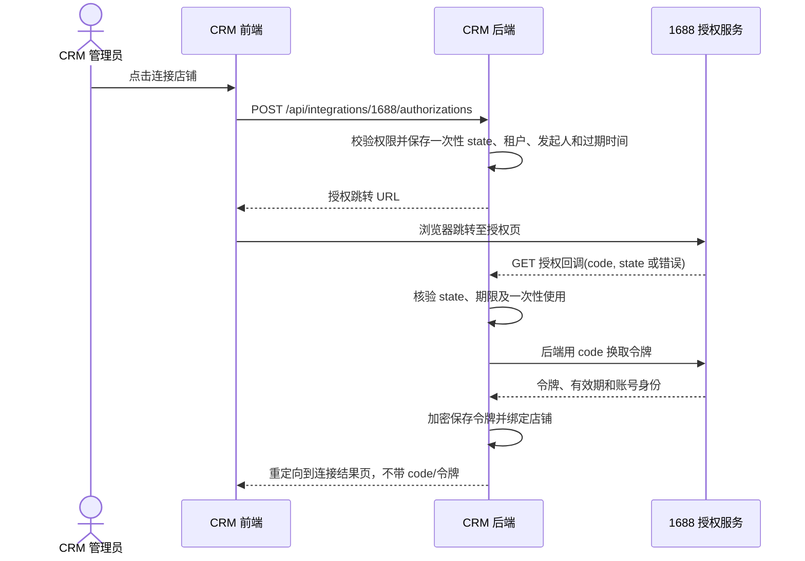

# 1688 官方接口接入设计（Web 授权）

> 版本：2026-09-17 设计稿。本文确定 CRM 侧的业务、界面与数据边界；带有“待核实”的平台接口细节须以当前应用在 1688 开放平台控制台获批的解决方案和 API 文档为准。

## 1. 目标与现状

目标是在现有销途 CRM 内完成“采集商品 -> 正式产品 -> 1688 店铺商品”和“1688 业务事件 -> 线索/客户”的可追溯流程。首期只做网页服务端授权，不做移动端或客户端授权。

现有项目已具备：

- `collected_products` / `collected_product_variants`：采集原始商品和 SKU 快照，已有采集工作区。原始数据保留作为溯源依据。
- `products` / `product_prices`：CRM 正式产品与人民币价格；报价模块使用正式产品。
- `leads` / `accounts` / `contacts`：线索、客户及联系人；已有查重与线索转客户流程。
- JWT、租户隔离、RBAC、审计日志：可复用作连接配置和人工发布的权限边界。

采集器密钥与 1688 OAuth 授权相互独立。采集到的第三方商品信息只作为编辑素材，不能因为已采集就认定有权代表某店铺发布；发布前必须由人确认内容、图片、价格和库存。

## 2. 信息架构与页面

侧边栏保留“1688 商品采集”；增加“1688 店铺”入口。采集工作区负责原始资料，店铺工作区负责授权、发布和同步。正式产品继续从“报价管理”的产品库进入，增加“平台关联”区块。

| 位置 | 页面/区域 | 主要内容 | 主操作 |
| --- | --- | --- | --- |
| 1688 店铺 > 概览 | 连接状态与待处理数 | 已授权店铺、授权到期、待发布、失败任务、待分配询盘 | 连接店铺、处理异常 |
| 1688 店铺 > 发布工作台 | 商品列表 + 状态筛选 | 采集来源、正式产品、目标店铺、缺失字段、上次提交 | 补全、预览、提交发布 |
| 1688 店铺 > 平台商品 | 已绑定商品表 | 平台商品 ID、CRM SKU、平台/CRM 价格、库存、状态、同步时间 | 查看差异、申请更新 |
| 1688 店铺 > 询盘与客户 | 事件收件箱 | 买家标识、内容/订单摘要、查重候选、负责人、处理状态 | 关联客户、转线索、分配 |
| 1688 店铺 > 同步记录 | 操作与错误表 | 对象、动作、结果、重试次数、时间、操作者、请求 ID | 查看详情、重试 |
| 1688 店铺 > 连接设置 | 连接列表 | 店铺标识、授权状态、权限能力、到期时间 | 网页授权、重新授权、停用 |

桌面版采用紧凑表格和右侧详情抽屉；窄屏改为同字段的纵向记录列表，详情全屏。主操作始终在表格工具栏或详情底部。授权与发布都显示真实服务器状态，不用只在前端切换的“已连接/已发布”状态。

### 2.1 连接设置草图

```text
1688 店铺 / 连接设置                                  [连接店铺]
┌───────────────────────────────────────────────────────────────┐
│ 店铺/账号        状态       授权有效期    能力             操作 │
│ XX 商贸          已连接     2026-..     商品读/写...     查看 │
└───────────────────────────────────────────────────────────────┘

详情抽屉
店铺身份 | 授权时间 | Access Token 有效期 | Refresh Token 有效期
可用能力：商品读取 / 商品发布 / 商品修改 / 消息或订单（逐项探测）
最近调用：时间、结果、请求 ID
[重新授权] [测试连接] [停用连接]
```

空状态只展示“连接店铺”；授权失败时展示平台错误摘要与“重新授权”；权限不足时点明缺少哪项能力，不显示不可用的发布按钮。AppKey 可显示尾号；AppSecret 与令牌永不回显。

### 2.2 发布工作台草图

```text
1688 店铺 / 发布工作台  [全部] [待补全] [待审核] [发布中] [已发布] [失败]
搜索商品或 SKU    店铺筛选    来源筛选
商品                 CRM 产品     目标店铺   完整度     状态       操作
工业紧固件...         SKU-001      XX 商贸    8/10       待补全     编辑

详情：原始采集 | 正式产品 | 平台要求 | 发布记录
左：可编辑标题、描述、类目、属性、主图、SKU、价格、库存
右：校验清单（必填/格式/图片可用性/价格与库存/类目映射）
底部：[保存草稿] [预览变更] [提交发布]
```

缺失项按字段定位；平台类目和属性由授权店铺的接口能力决定，不能把采集来源类目直接当作发布类目。提交前显示将写入的店铺、商品、SKU 数和价格范围，由有发布权限的用户确认。超时或未知结果先查询平台状态，不盲目重复创建。

### 2.3 询盘与客户草图

事件列表突出“待认领 / 疑似重复 / 已关联 / 无法处理”。详情抽屉并列显示平台买家资料、原始询盘与 CRM 候选客户；可手动选择“关联现有客户”“创建线索”“忽略”。只有 API 实际开放且应用获得权限时才启用自动接入；首期不依赖该能力完成商品流程。

## 3. Web 授权流程

采用服务端 OAuth 授权码流程，AppKey/AppSecret 仅保存在后端配置。一个部署使用一个 1688 应用；每个 CRM 租户可以连接多个店铺，店铺授权与租户绑定。授权页仅由后端构造受控跳转 URL。



- 回调使用固定 HTTPS 地址，与平台应用配置一致；`state` 为高熵一次性值，10 分钟内有效，消费后立即失效。回调不接受任意 `redirect_uri`，前端返回位置只取服务端白名单。
- 回调可能没有现成的 CRM 登录态，因此用服务端保存的 `state` 找回租户和发起人；禁止从回调查询参数直接指定租户。平台拒绝授权、state 不匹配、换令牌失败都有独立错误状态。
- 令牌服务器端加密保存，密钥与数据库分离；日志、审计和错误消息不包含 `code`、AppSecret、access/refresh token。令牌刷新要持久化最新返回值并处理并发刷新；刷新失败转“需重新授权”。
- 连接成功后先读取/验证店铺身份和实际权限，再启用相应功能。店铺身份的字段与检查 API 待核实；同一平台店铺只允许一个活动租户绑定，重复授权更新原连接，跨租户绑定直接拒绝并提示管理员处理。
- “停用连接”立即停止新任务与定时同步；是否调用平台撤销接口以该应用获得的能力为准。历史商品绑定、事件和日志保留。

平台授权 URL、令牌交换/刷新路径、签名方式、请求限流和过期规则均需要在 1688 控制台用当前应用核对。不能直接套用淘宝开放平台的 `oauth.taobao.com` / TOP 网关说明。

## 4. 商品与客户业务规则

### 4.1 商品状态与数据归属

```text
采集记录 (source snapshot) -> 正式产品 (CRM SKU) -> 发布草稿 (店铺专属)
  -> 待审核 -> 提交中 -> 平台商品绑定 -> 同步中/已同步/冲突/失败
```

`collected_products.processing_status` 只描述采集数据处理进度，不承担平台发布任务状态。正式产品是报价用的内部主数据；平台商品是某店铺的一份映射，单个正式产品可映射多个店铺。平台修改后先生成差异，不自动覆盖 CRM 产品价格；CRM 编辑后也不自动写回平台，用户在发布工作台审阅并提交。为保证能表达图片、SKU、平台类目和库存，发布草稿独立保存平台字段和源产品版本/快照。

第一次发布必须通过正式产品审核；发布前检查店铺授权、发布权限、平台类目及必填属性、图片可访问性、SKU 唯一性、价格/库存合法性。发布请求使用本地任务唯一键和目标店铺+正式产品约束防重复；回调/轮询结果幂等写入商品绑定。编辑已发布商品时展示字段差异与影响范围。平台支持增量修改的字段和 API 必须逐项核实，未获准字段保持只读。

### 4.2 客户与询盘

如果该解决方案开放买家/询盘/订单消息：先存外部事件和平台买家标识，随后按平台买家 ID 精确匹配已绑定客户，再用企业名/电话/邮箱做候选查重；低置信度由人工确认。原始事件可重放，重复回调以平台事件 ID 幂等处理。CRM 线索填 `source='1688'`、保留平台事件引用，客户侧显示来源和关联店铺。平台订单仅在订单模块可用、字段和权限明确后进入订单流程。

## 5. 接口与数据草案

下表是 CRM 自有 API 契约，不代表 1688 的真实 API 名称。

| CRM API | 权限 | 用途 |
| --- | --- | --- |
| `GET /api/integrations/1688/connections` | `integration:read` | 列表和能力/过期状态 |
| `POST /api/integrations/1688/authorizations` | `integration:manage` | 创建 state 并返回授权 URL |
| `GET /api/integrations/1688/callback` | 公共回调 + state 校验 | 换令牌、建连接、重定向结果页 |
| `POST /api/integrations/1688/connections/:id/test` | `integration:manage` | 测试身份与权限，不回显密钥 |
| `POST /api/integrations/1688/connections/:id/disable` | `integration:manage` | 停止同步和新发布任务 |
| `GET /api/integrations/1688/publish-candidates` | `product:read` | 可发布商品、缺失项、状态 |
| `POST /api/integrations/1688/publish-jobs` | `integration:publish` | 从已审核草稿创建发布任务 |
| `GET /api/integrations/1688/listings` | `integration:read` | 平台商品绑定及差异 |
| `GET /api/integrations/1688/events` | `integration:read` | 买家/询盘事件收件箱 |
| `POST /api/integrations/1688/events/:id/resolve` | 按动作检查 `account:update` / `lead:create` / `integration:manage` | 关联客户/创建线索/忽略 |
| `GET /api/integrations/1688/operations` | `integration:read` | 同步与调用记录 |

下一次数据库变更使用 `database/migrations/011_...sql`，不改已应用迁移。拟新增：

| 表 | 关键字段与约束 |
| --- | --- |
| `integration_1688_oauth_states` | `state_hash` 唯一、`tenant_id`、`created_by`、`expires_at`、`consumed_at`；短期清理 |
| `integration_1688_connections` | `tenant_id`、`platform_account_id`、店铺名、加密令牌、各自过期时间、状态、能力快照；活动连接唯一约束 |
| `integration_1688_publish_drafts` | `tenant_id`、`connection_id`、`product_id`、`collected_product_id`、映射字段、校验结果、草稿版本、审核人/时间 |
| `integration_1688_publish_jobs` | `tenant_id`、`connection_id`、`draft_id`、幂等键、请求摘要、任务状态、重试计划、外部请求 ID |
| `integration_1688_product_bindings` | `tenant_id`、`connection_id`、`product_id`、平台商品 ID、同步游标/快照/时间；店铺+平台商品 ID 唯一 |
| `integration_1688_events` | `tenant_id`、`connection_id`、平台事件 ID/类型、买家 ID、最小必要载荷、接收/处理状态；事件去重约束 |
| `integration_1688_customer_bindings` | `tenant_id`、`connection_id`、平台买家 ID、`account_id`、关联来源；店铺+买家 ID 唯一 |
| `integration_1688_operations` | `tenant_id`、对象/动作、结果、错误码、请求 ID、耗时、操作者、重试次数；不存令牌或完整敏感报文 |

所有读写查询都限定 `tenant_id`，关联对象要校验同租户；外部 ID 保持字符串，避免大整数精度问题。客户资料只落必要字段，原始载荷设置保留期限。消息接入若采用回调，先按平台文档验签并幂等入库；若无可用消息订阅，则使用获批的查询接口定时拉取。发布任务建议先用数据库任务表和单独 worker，避免 HTTP 请求等待平台处理；限制单店并发，按平台限流与错误码退避。

## 6. 分期与验收

| 阶段 | 交付 | 验收依据 |
| --- | --- | --- |
| A：连接 | Web 授权、店铺身份、加密令牌、刷新/重授权、连接设置页 | 成功/拒绝/过期/错误 state/并发刷新用例；跨租户不可访问 |
| B：商品准备 | 采集转正式产品、发布草稿、类目属性映射、人工审核 | 草稿校验与报价产品数据一致；未审核不可提交 |
| C：发布同步 | 发布任务、平台商品绑定、状态查询、失败重试、差异预览 | 超时不重复创建；重试幂等；平台与 CRM 差异可见 |
| D：客户接入 | 获批的询盘/买家事件、查重、客户关联与线索转化 | 事件去重；人工确认候选；来源可追溯 |

**平台侧待核实清单：** 当前应用类别及已订购解决方案；回调域名配置；正式授权 URL 与 token 交换/刷新接口；商品发布、详情、列表、修改和图片上传的具体 API/字段/调用权限；消息或订单订阅方式；限流、签名、错误码和测试环境。A 阶段开始前完成授权项核对；C/D 阶段分别以实际获批接口为准，不以其他阿里平台文档推断可用性。

## 7. 参考与依据

- 用户指定的 [1688 应用接入文档](https://open.1688.com/doc/appJoin.htm)：本设计的授权范围入口；当前公开抓取无法读取正文，具体参数待在开发者控制台确认。
- 用户指定的 [1688 解决方案页面](https://open.1688.com/solution/solutionDetail.htm?solutionKey=1668600046917#apiAndMessageList)：用于核对该应用实际可订购 API 与消息。
- [阿里巴巴开放平台首页](https://aop.alibaba.com/)：确认存在商品管理、订单管理等业务场景；首页内容不等于当前应用获得接口权限。
- 项目内 `src/ProductCollectionsPage.tsx`、`database/migrations/009_product_collection.sql`、`database/migrations/001_initial_schema.sql` 及现有 CRM API/权限实现。
