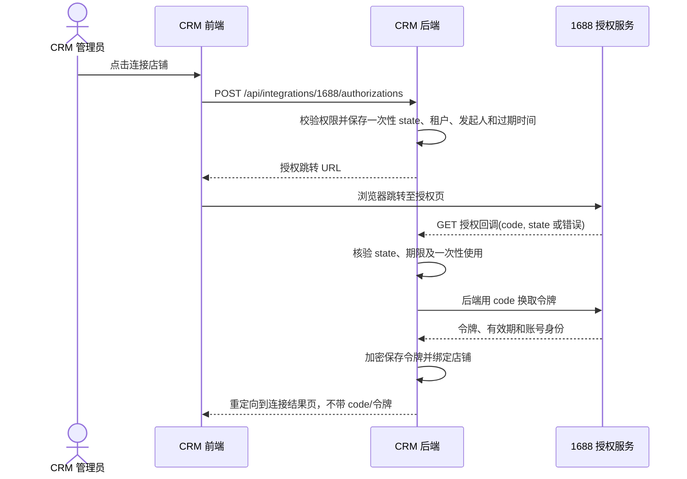

# 1688 官方接口接入设计（Web 授权）

> 版本：2026-09-22 设计稿。本文确定 CRM 侧的业务、界面与数据边界；授权、签名和网关规则已根据本地保存的 1688 官方文档核实，具体业务 API 仍以当前应用在开放平台控制台获批的解决方案为准。

## 1. 目标与现状

目标是在现有销途 CRM 内完成“采集商品 -> 正式产品 -> 1688 店铺商品”和“1688 业务事件 -> 线索/客户”的可追溯流程。首期只做网页服务端授权，不做移动端或客户端授权。

现有项目已具备：

- `collected_products` / `collected_product_variants`：采集原始商品和 SKU 快照，已有采集工作区。原始数据保留作为溯源依据。
- `products` / `product_prices`：CRM 正式产品与人民币价格；报价模块使用正式产品。
- `leads` / `accounts` / `contacts`：线索、客户及联系人；已有查重与线索转客户流程。
- JWT、租户隔离、RBAC、审计日志：可复用作连接配置和人工发布的权限边界。

采集器密钥与 1688 OAuth 授权相互独立。采集到的第三方商品信息只作为编辑素材，不能因为已采集就认定有权代表某店铺发布；发布前必须由人确认内容、图片、价格和库存。

## 2. 信息架构与页面

侧边栏保留“1688 商品采集”；增加“1688 店铺”入口。采集工作区负责原始资料，店铺工作区负责授权、发布和同步。正式产品继续从“报价管理”的产品库进入，增加“平台关联”区块。

| 位置 | 页面/区域 | 主要内容 | 主操作 |
| --- | --- | --- | --- |
| 1688 店铺 > 概览 | 连接状态与待处理数 | 已授权店铺、授权到期、待发布、失败任务、待分配询盘 | 连接店铺、处理异常 |
| 1688 店铺 > 发布工作台 | 商品列表 + 状态筛选 | 采集来源、正式产品、目标店铺、缺失字段、上次提交 | 补全、预览、提交发布 |
| 1688 店铺 > 平台商品 | 已绑定商品表 | 平台商品 ID、CRM SKU、平台/CRM 价格、库存、状态、同步时间 | 查看差异、申请更新 |
| 1688 店铺 > 询盘与客户 | 事件收件箱 | 买家标识、内容/订单摘要、查重候选、负责人、处理状态 | 关联客户、转线索、分配 |
| 1688 店铺 > 同步记录 | 操作与错误表 | 对象、动作、结果、重试次数、时间、操作者、请求 ID | 查看详情、重试 |
| 1688 店铺 > 连接设置 | 连接列表 | 店铺标识、授权状态、权限能力、到期时间 | 网页授权、重新授权、停用 |

桌面版采用紧凑表格和右侧详情抽屉；窄屏改为同字段的纵向记录列表，详情全屏。主操作始终在表格工具栏或详情底部。授权与发布都显示真实服务器状态，不用只在前端切换的“已连接/已发布”状态。

### 2.1 连接设置草图

```text
1688 店铺 / 连接设置                                  [连接店铺]
┌───────────────────────────────────────────────────────────────┐
│ 店铺/账号        状态       授权有效期    能力             操作 │
│ XX 商贸          已连接     2026-..     商品读/写...     查看 │
└───────────────────────────────────────────────────────────────┘

详情抽屉
店铺身份 | 授权时间 | Access Token 有效期 | Refresh Token 有效期
可用能力：商品读取 / 商品发布 / 商品修改 / 消息或订单（逐项探测）
最近调用：时间、结果、请求 ID
[重新授权] [测试连接] [停用连接]
```

空状态只展示“连接店铺”；授权失败时展示平台错误摘要与“重新授权”；权限不足时点明缺少哪项能力，不显示不可用的发布按钮。AppKey 可显示尾号；AppSecret 与令牌永不回显。

### 2.2 发布工作台草图

```text
1688 店铺 / 发布工作台  [全部] [待补全] [待审核] [发布中] [已发布] [失败]
搜索商品或 SKU    店铺筛选    来源筛选
商品                 CRM 产品     目标店铺   完整度     状态       操作
工业紧固件...         SKU-001      XX 商贸    8/10       待补全     编辑

详情：原始采集 | 正式产品 | 平台要求 | 发布记录
左：可编辑标题、描述、类目、属性、主图、SKU、价格、库存
右：校验清单（必填/格式/图片可用性/价格与库存/类目映射）
底部：[保存草稿] [预览变更] [提交发布]
```

缺失项按字段定位；平台类目和属性由授权店铺的接口能力决定，不能把采集来源类目直接当作发布类目。提交前显示将写入的店铺、商品、SKU 数和价格范围，由有发布权限的用户确认。超时或未知结果先查询平台状态，不盲目重复创建。

### 2.3 询盘与客户草图

事件列表突出“待认领 / 疑似重复 / 已关联 / 无法处理”。详情抽屉并列显示平台买家资料、原始询盘与 CRM 候选客户；可手动选择“关联现有客户”“创建线索”“忽略”。只有 API 实际开放且应用获得权限时才启用自动接入；首期不依赖该能力完成商品流程。

## 3. Web 授权流程

采用服务端 OAuth 2.0 授权码流程，AppKey/AppSecret 仅保存在后端配置。一个部署使用一个 1688 应用；每个 CRM 租户可以连接多个店铺，店铺授权与租户绑定。授权页仅由后端构造受控跳转 URL。



- 回调使用固定 HTTPS 地址，与平台应用配置一致；`state` 为高熵一次性值，10 分钟内有效，消费后立即失效。回调不接受任意 `redirect_uri`，前端返回位置只取服务端白名单。
- 回调可能没有现成的 CRM 登录态，因此用服务端保存的 `state` 找回租户和发起人；禁止从回调查询参数直接指定租户。平台拒绝授权、state 不匹配、换令牌失败都有独立错误状态。
- 令牌服务器端加密保存，密钥与数据库分离；日志、审计和错误消息不包含 `code`、AppSecret、access/refresh token。令牌刷新要持久化最新返回值并处理并发刷新；刷新失败转“需重新授权”。
- 连接成功后先读取/验证店铺身份和实际权限，再启用相应功能。店铺身份的字段与检查 API 待核实；同一平台店铺只允许一个活动租户绑定，重复授权更新原连接，跨租户绑定直接拒绝并提示管理员处理。
- “停用连接”立即停止新任务与定时同步；是否调用平台撤销接口以该应用获得的能力为准。历史商品绑定、事件和日志保留。

### 3.1 已核实的授权参数

**发起 Web 授权：**

```text
GET https://auth.1688.com/oauth/authorize
  ?client_id={APP_KEY}
  &site=1688
  &redirect_uri={URL_ENCODED_CALLBACK}
  &state={ONE_TIME_STATE}
```

`client_id` 即 AppKey；`site` 固定为 `1688`；回调域名必须与应用注册时填写的域名匹配。平台以 query string 将 `code` 和原样 `state` 回传。官方文档将 `state` 标为可选，CRM 实现中必须使用。`code` 只能使用一次，有效期 2 分钟，因此回调应立即在后端换取令牌。

**用 code 换取令牌：**

```text
POST https://gw.open.1688.com/openapi/http/1/system.oauth2/getToken/{APP_KEY}

grant_type=authorization_code
need_refresh_token=true
client_id={APP_KEY}
client_secret={APP_SECRET}
redirect_uri={CALLBACK}
code={CODE}
```

此接口必须使用 HTTPS POST，且不需要 `_aop_signature`。返回字段包括 `aliId`、`resource_owner`、`memberId`、`expires_in`、`access_token`、`refresh_token` 和 `refresh_token_timeout`。文档规定 `access_token` 有效期为 10 小时，示例中的 `expires_in` 为 `36000` 秒。

**刷新 access token：**

```text
POST https://gw.open.1688.com/openapi/http/1/system.oauth2/getToken/{APP_KEY}

grant_type=refresh_token
client_id={APP_KEY}
client_secret={APP_SECRET}
refresh_token={REFRESH_TOKEN}
```

刷新同样使用 HTTPS POST 且不签名。实现以 `refresh_token_timeout` 作为实际过期依据，并保存每次响应中最新的 refresh token；若返回值与本地不同，立即废弃旧值。官方正文一处说明 refresh token 有效期与服务市场订购周期一致，流程说明又以“半年”为失效边界，两者存在口径差异，因此不能硬编码半年。用户修改密码、订购到期或取消授权也会使 refresh token 失效，此时连接进入“需重新授权”。

### 3.2 API 网关与签名

普通 API 请求格式为：

```text
https://gw.open.1688.com/openapi/param2/{version}/{namespace}/{apiName}/{APP_KEY}
  ?{apiParams}
  &access_token={ACCESS_TOKEN}
  &_aop_timestamp={UNIX_MILLISECONDS}
  &_aop_signature={SIGNATURE}
```

仅在接口要求时传入 `access_token`、`_aop_timestamp` 和 `_aop_signature`。签名规则如下：

1. 取从 `param2` 开始至 `?` 之前的 URL path，例如 `param2/1/system/currentTime/1000000`。
2. 将所有参与签名的请求参数按参数名升序排列，并将每个参数名和值直接连接；文件上传接口中的文件字节流参数不参与签名。
3. 将 URL path 与排序后的参数串连接。
4. 使用 AppSecret 对结果执行 HMAC-SHA1，转为十六进制并大写，作为 `_aop_signature`。

授权页签名在两份官方页面中存在不一致：当前“API 授权说明”的 Web 流程使用 `https://auth.1688.com/oauth/authorize` 且未要求签名；“签名规则”仍描述旧式 `gw.open.1688.com/auth/authorize.htm` 和 `_aop_signature`。本设计采用授权说明中的 OAuth 地址，联调时以当前应用控制台和真实跳转结果确认，不复用普通 API 的 URL path 签名规则。

日志只记录 API 名、脱敏参数摘要、平台请求 ID、错误码和耗时。官方接入说明建议记录失败 URL 与参数以便排错，但完整 URL 可能包含 `access_token`、签名及业务数据，CRM 不保存原始查询串。

## 4. 商品与客户业务规则

### 4.1 商品状态与数据归属

```text
采集记录 (source snapshot) -> 正式产品 (CRM SKU) -> 发布草稿 (店铺专属)
  -> 待审核 -> 提交中 -> 平台商品绑定 -> 同步中/已同步/冲突/失败
```

`collected_products.processing_status` 只描述采集数据处理进度，不承担平台发布任务状态。正式产品是报价用的内部主数据；平台商品是某店铺的一份映射，单个正式产品可映射多个店铺。平台修改后先生成差异，不自动覆盖 CRM 产品价格；CRM 编辑后也不自动写回平台，用户在发布工作台审阅并提交。为保证能表达图片、SKU、平台类目和库存，发布草稿独立保存平台字段和源产品版本/快照。

第一次发布必须通过正式产品审核；发布前检查店铺授权、发布权限、平台类目及必填属性、图片可访问性、SKU 唯一性、价格/库存合法性。发布请求使用本地任务唯一键和目标店铺+正式产品约束防重复；回调/轮询结果幂等写入商品绑定。编辑已发布商品时展示字段差异与影响范围。平台支持增量修改的字段和 API 必须逐项核实，未获准字段保持只读。

### 4.2 客户与询盘

如果该解决方案开放买家/询盘/订单消息：先存外部事件和平台买家标识，随后按平台买家 ID 精确匹配已绑定客户，再用企业名/电话/邮箱做候选查重；低置信度由人工确认。原始事件可重放，重复回调以平台事件 ID 幂等处理。CRM 线索填 `source='1688'`、保留平台事件引用，客户侧显示来源和关联店铺。平台订单仅在订单模块可用、字段和权限明确后进入订单流程。

## 5. 接口与数据草案

下表是 CRM 自有 API 契约，不代表 1688 的真实 API 名称。

| CRM API | 权限 | 用途 |
| --- | --- | --- |
| `GET /api/integrations/1688/connections` | `integration:read` | 列表和能力/过期状态 |
| `POST /api/integrations/1688/authorizations` | `integration:manage` | 创建 state 并返回授权 URL |
| `GET /api/integrations/1688/callback` | 公共回调 + state 校验 | 换令牌、建连接、重定向结果页 |
| `POST /api/integrations/1688/connections/:id/test` | `integration:manage` | 测试身份与权限，不回显密钥 |
| `POST /api/integrations/1688/connections/:id/disable` | `integration:manage` | 停止同步和新发布任务 |
| `GET /api/integrations/1688/publish-candidates` | `product:read` | 可发布商品、缺失项、状态 |
| `POST /api/integrations/1688/publish-jobs` | `integration:publish` | 从已审核草稿创建发布任务 |
| `GET /api/integrations/1688/listings` | `integration:read` | 平台商品绑定及差异 |
| `GET /api/integrations/1688/events` | `integration:read` | 买家/询盘事件收件箱 |
| `POST /api/integrations/1688/events/:id/resolve` | 按动作检查 `account:update` / `lead:create` / `integration:manage` | 关联客户/创建线索/忽略 |
| `GET /api/integrations/1688/operations` | `integration:read` | 同步与调用记录 |

下一次数据库变更使用 `database/migrations/011_...sql`，不改已应用迁移。拟新增：

| 表 | 关键字段与约束 |
| --- | --- |
| `integration_1688_oauth_states` | `state_hash` 唯一、`tenant_id`、`created_by`、`expires_at`、`consumed_at`；短期清理 |
| `integration_1688_connections` | `tenant_id`、`platform_account_id`、店铺名、加密令牌、各自过期时间、状态、能力快照；活动连接唯一约束 |
| `integration_1688_publish_drafts` | `tenant_id`、`connection_id`、`product_id`、`collected_product_id`、映射字段、校验结果、草稿版本、审核人/时间 |
| `integration_1688_publish_jobs` | `tenant_id`、`connection_id`、`draft_id`、幂等键、请求摘要、任务状态、重试计划、外部请求 ID |
| `integration_1688_product_bindings` | `tenant_id`、`connection_id`、`product_id`、平台商品 ID、同步游标/快照/时间；店铺+平台商品 ID 唯一 |
| `integration_1688_events` | `tenant_id`、`connection_id`、平台事件 ID/类型、买家 ID、最小必要载荷、接收/处理状态；事件去重约束 |
| `integration_1688_customer_bindings` | `tenant_id`、`connection_id`、平台买家 ID、`account_id`、关联来源；店铺+买家 ID 唯一 |
| `integration_1688_operations` | `tenant_id`、对象/动作、结果、错误码、请求 ID、耗时、操作者、重试次数；不存令牌或完整敏感报文 |

所有读写查询都限定 `tenant_id`，关联对象要校验同租户；外部 ID 保持字符串，避免大整数精度问题。客户资料只落必要字段，原始载荷设置保留期限。消息接入若采用回调，先按平台文档验签并幂等入库；若无可用消息订阅，则使用获批的查询接口定时拉取。发布任务建议先用数据库任务表和单独 worker，避免 HTTP 请求等待平台处理；限制单店并发，按平台限流与错误码退避。

## 6. 分期与验收

| 阶段 | 交付 | 验收依据 |
| --- | --- | --- |
| A：连接 | Web 授权、店铺身份、加密令牌、刷新/重授权、连接设置页 | 成功/拒绝/过期/错误 state/并发刷新用例；跨租户不可访问 |
| B：商品准备 | 采集转正式产品、发布草稿、类目属性映射、人工审核 | 草稿校验与报价产品数据一致；未审核不可提交 |
| C：发布同步 | 发布任务、平台商品绑定、状态查询、失败重试、差异预览 | 超时不重复创建；重试幂等；平台与 CRM 差异可见 |
| D：客户接入 | 获批的询盘/买家事件、查重、客户关联与线索转化 | 事件去重；人工确认候选；来源可追溯 |

**平台侧待核实清单：** 当前应用类别及已订购解决方案；回调域名配置；商品发布、详情、列表、修改和图片上传的具体 API/字段/调用权限；消息或订单订阅方式；业务 API 限流、错误码和测试环境；当前 OAuth 授权入口是否要求额外参数签名。A 阶段联调时完成应用配置核对；C/D 阶段分别以实际获批接口为准。

## 7. 参考与依据

- 本地 SingleFile 官方文档：[app接入.html](/Users/mac/Documents/CRM-feat-domestic-crm-adaptation/docs/app接入.html)、[api授权.html](/Users/mac/Documents/CRM-feat-domestic-crm-adaptation/docs/api授权.html)、[api调用.html](/Users/mac/Documents/CRM-feat-domestic-crm-adaptation/docs/api调用.html)、[签名规则.html](/Users/mac/Documents/CRM-feat-domestic-crm-adaptation/docs/签名规则.html)，页面显示更新时间为 2026-08-19。
- [1688 应用接入文档](https://open.1688.com/doc/appJoin.htm)：本地保存页面的原始地址。
- 用户指定的 [1688 解决方案页面](https://open.1688.com/solution/solutionDetail.htm?solutionKey=1668600046917#apiAndMessageList)：用于核对该应用实际可订购 API 与消息。
- [阿里巴巴开放平台首页](https://aop.alibaba.com/)：确认存在商品管理、订单管理等业务场景；首页内容不等于当前应用获得接口权限。
- 项目内 `src/ProductCollectionsPage.tsx`、`database/migrations/009_product_collection.sql`、`database/migrations/001_initial_schema.sql` 及现有 CRM API/权限实现。

## 8. 首批实现与验收（2026-09-29）

依据用户提供的 `/Users/mac/Documents/1688api.md`（新版商品管理解决方案，版本 2.2），当前只开放完整参数已核实的功能。实现采用同步 HTTP + 数据库原子提交锁，不是后台发布队列；发布成功代表已取得平台商品 ID，不代表平台审核通过，需刷新平台详情查看实际状态。

| 工作流 | 官方接口 / 本地实现 | 验证 |
| --- | --- | --- |
| 店铺连接 | Web OAuth、`system.oauth2/getToken`、`com.alibaba.account/alibaba.account.basic` | 已取得真实令牌并验证账号；刷新/state 重放/租户隔离模拟验证 |
| 平台商品 | `alibaba.product.list.get`、`alibaba.product.get` | 真实读取首批 20 件，总数 1162；界面全量分页同步可停止，已保存页不会丢失 |
| 商品准备 | `/api/product-collections/:id/promote`、独立 `product_variants` | 人工确认人民币价格/库存/图片权利；事务及源快照独立通过测试 |
| 发布工作台 | `alibaba.category.searchByKeyword`、`alibaba.new.product.getSchema`、`alibaba.new.product.add` | 真实类目规则已验证；发布仅模拟验收，版本冲突和超时重复提交被拒绝 |
| 图片 | `alibaba.photobank.photo.add`，multipart 的 `imageBytes` 不参与签名 | 2MB 格式检查和 multipart 签名模拟验证；需要真实相册 ID，未进行平台上传 |
| 库存 | `alibaba.product.modifyStock` | 使用官方拼写 `increaceModify=false`，SKU 参数 `skuId` 实际传 `specId`；提交前重新获取并核对库存。绝对写入仍无法消除平台在读取后发生的外部并发改动，界面确认前应协调店铺操作 |

### 使用与配置

- 侧边栏「1688 店铺」包含平台商品、发布工作台、连接设置和同步记录；「1688 商品采集」详情可审核转正式产品，然后在店铺发布工作台创建草稿。
- 当前回调域名落到远端首页，暂采用复制完整回跳地址到本地连接对话框的方式完成授权，不声称已接入自动回调路由。授权码 2 分钟有效，state 10 分钟且只可消费一次。
- 令牌使用 AES-256-GCM 加密后存入数据库，不通过 API 返回。开发密钥为 `.1688-key.local`；生产必须配置 `ALI1688_TOKEN_ENCRYPTION_KEY`（64 位十六进制）。密钥与数据库须分别安全备份，遗失密钥需重新授权。
- `npm run 1688:import-token` 可导入首次授权脚本生成的本地私有令牌文件；`npm run 1688:sync` 只读首批商品并验证类目 schema，不会全量同步或发布。
- `npm run test:1688` 使用独立测试租户与模拟网关，覆盖连接、发布、SKU 映射及规则更新检查并清理数据，不进行任何平台写操作。`npm run test:1688-skus` 覆盖 12 项 SKU 生成与映射逻辑检查。
- `scripts/verify-1688-ui.mjs` 使用已安装 Chrome 的独立无头会话，仅测试本地页面；设置 `PLAYWRIGHT_MODULE` 为可用 Playwright 的 `index.mjs` 路径。截图存于 `/tmp/crm-1688-ui`。
- 连接/同步需要 `integration:manage`，发布/图片/库存需要 `integration:publish`，查看需要 `integration:read`。角色迁移后原登录会话需要重新登录刷新权限。

### 后续范围

销售规格与 SKU 已支持枚举选择、自定义值、组合预览、正式产品属性映射和报价库存表单；部分特殊平台字段仍使用 JSON，尚未完成全类目级联。商品编辑/价格修改、视频/物流模板、消息回调、后台任务与定时刷新仍待接入。发布异常或中断进入 `unknown`/`submitting`，禁止自动重发，可查询平台后手工输入商品 ID 核对归属、标题与唯一关联。

本方案未包含询盘/买家客户 API 的完整请求定义，消息列表也未提供消息载荷及验签规则。因此客户/线索接入仍待对应解决方案文档和获批权限，不猜测接口或将商品消息当作客户消息。

## 9. SKU 发布准备（2026-09-29）

- 销售属性来自官方 schema 的 `saleProp.fields.dataSource`，仅允许官方枚举或明确允许的自定义值；属性 ID 使用平台 `propertyId`，不复用采集来源 ID。
- 手工生成组合前展示保留、新增、移除数量，确认后才替换本地编辑值；同一规格组合按属性 ID/值/文本匹配，保留原价格、库存、货号及其它列。新组合的库存留空，必须核对后才能发布；组合最多 2000 个。
- `GET /api/integrations/1688/drafts/:id/variants` 读取该正式产品的独立 SKU；`POST .../:id/map-variants` 接收版本、人工属性映射与覆盖确认。枚举匹配采用文本精确匹配；缺少属性、不支持的值或多条来源映射到同一组合时拒绝全部更新。映射只复制实际正式 SKU，不补造不存在的组合，也不写回正式产品或平台。
- 映射会复制每条已审核的价格、库存与图片；未知库存保持空。SKU 报价列及按数量报价规则仍由平台 schema 决定，应核对「报价方式」，按规格报价时每个 SKU 都需正数单价。
- `POST .../:id/sku-rules` 仅在官方 SKU 组件声明 `supportLevelProp=true` 时开放。按文档发送 `catId`、`scene`、`dataBody={global,data:{skuTable:{}}}`，工业品附加 `bizParam.industryCategoryId`。只合并返回的 SKU 组件元数据，保留草稿 `formValues`、其它字段及全局上下文；读取期间版本变化会拒绝覆盖。
- 返回 `reload=true` 时要求重新获取完整规则，当前不会自动替换用户数据。该入口不是所有字段的通用级联实现，未推测文档未提供的依赖值传参方式。
- SKU 表按返回元数据扩展会员价格等数值/文本列，遵守可见性和只读设置；复杂非标列保留原值，不自行推测控件或转换数据。
- 浏览器验证脚本 `scripts/verify-1688-sku-ui.mjs` 将草稿相关请求全部替换为本地模拟响应，验证生成、保留、保存、规则刷新、映射确认及桌面/手机布局；截图位于 `/tmp/crm-1688-sku-ui`，不会操作真实平台商品。

## 10. 已有商品关联与差异报告（2026-09-29）

- 「平台商品」详情增加 CRM 关联与差异区。选择已启用正式产品后读取其独立 SKU，人工逐一选择平台 `specId` 对应的 CRM 规格；允许暂不匹配，不按名称自动猜测。确认后只保存本地关联，不覆盖任何一方的标题、图片、价格或库存。
- 新增并应用迁移 `014_1688_listing_bindings.sql`，保存 `binding_revision` 与 `sku_bindings`。同店铺的同一正式产品只允许关联一个平台商品；不同店铺可分别关联。更换产品须先明确解除旧关联，解除保留双方商品。
- `GET /api/integrations/1688/listings/:id/comparison` 需要 `integration:read` 和 `product:read`，使用一致性只读事务读取平台快照及正式产品/规格；可选 `productId` 用于当前组织已启用产品的关联前预览，不保存关联，也不调用平台。
- `POST .../:id/binding` 需要 `integration:manage` 和 `product:read`，要求 `productId`、`revision`、`syncedAt`、`confirmed=true` 和 `bindings=[{specId,variantId}]`。重复 SKU、非本商品规格、非本产品规格、跨租户产品、关联或快照版本变化均拒绝；关联及解除记录审计。
- 比较标题、主图地址、基础单价及已匹配 SKU 的价格/库存。十进制字符串规范化比较，不通过浮点相减判断；缺失值、已移除规格、重复平台规格标识和币种不一致标为待核对。基础价格仅与平台从 1 件起的单一报价比较，阶梯价不使用最低档冒充基础单价。所有结论基于显示时间的本地快照，不代表实时平台状态。
- 手工关联与发布领取状态共用店铺事务锁，已有产品关联会阻止新建重复发布；发布中、结果待核对或发布生成的关联不能手工解除。刷新平台快照保留人工 SKU 映射，失效规格展示待核对而不自动重映射。
- `npm run test:1688-bindings` 使用隔离测试租户验证预览、权限、关联版本、唯一关联、SKU 校验、差异精度、发布保护、并发和解除，并确认 CRM 价格/库存未变化且外部调用为零。`scripts/verify-1688-binding-ui.mjs` 模拟商品/关联请求验证明确确认、SKU 匹配、差异展示及桌面/手机布局，截图位于 `/tmp/crm-1688-binding-ui`；未执行线上写操作。

## 11. Qwen Agent 上品（2026-09-29）

- 参考用户提供的 `qwen.md` 及 [qwen3.8-flash 官方能力](https://help.aliyun.com/zh/model-studio/qwen3-8-flash)、[视觉输入格式](https://help.aliyun.com/zh/model-studio/vision)。采用北京业务空间 OpenAI 兼容接口，模型固定 `qwen3.8-flash`；JSON 输出按 Zod 校验，图像通过 `image_url` 输入。全局助手同步更新模型白名单，保留旧型号。
- 系统设置按店铺授权自动模式，默认关闭。开启要求 `integration:manage`、`integration:publish` 及确认使用权/数据传输/自动发布授权；设置更新带版本及审计。`POST /agent/test` 使用小型纯文本请求测试连接，不传商品资料、不调用店铺。
- 从已审核正式产品及已选类目开始，在页面新建发布草稿后自动调用 `POST /drafts/:id/agent`（需要发布和产品读取权限）。已有草稿可主动启动。接口同步运行并持久化任务，不是后台批处理或采集自动审核；切断页面不会主动撤销已提交请求，服务中断后任务不会自动重发。
- 生成客观新标题和有依据的枚举类目属性。自动 SKU 只用经审核的正式规格，沿用现有映射算法校验平台枚举、组合、价格和库存；当前已有 SKU 表则保留。AI 不生成价格、库存、图片地址、物流条款或资质；未知必填字段、特殊组件和平台校验失败转为中止，不能声称全类目自动填写。平台发布规则实际为 JSON schema/dataBody，不生成未经平台定义的 XML。
- 检测最终待发布主图、映射后 SKU 图片和 HTML 详情图。HTML 使用 `htmlparser2` 解析，样式/嵌入媒体/srcset 等未覆盖内容中止；自动路径只接受 HTTPS `cbu数字.alicdn.com` 图片地址，每次最多 40 张，分批每批 4 张。每张都必须返回唯一序号及完整检测结果；整图不可读、明确公司/店铺水印或知名品牌 Logo、输出截断或模型错误不发布。水印/Logo 必须有具体可读名称、模型置信度至少 0.98；车型轮廓、普通营销文字、模糊标识与不确定的授权推断不构成图片阻断条件。不得将未检测或未知误判为无风险。
- 图片风险报告是模型观察，不提供版权登记查询、授权链验证或法律侵权结论，也无法发现所有风险。用户仍须保证商品及图片的使用权。风险通过文字弹窗提示，不移除水印或伪造授权。

## 12. Qwen 图片工作台（2026-10-06）

- 依据用户保存的千问图像 API 文档，使用北京业务空间 OpenAI 兼容 `/images/generations`：无 `image` 为文生图，有草稿主图 URL 为图生图，支持 `qwen-image-3.0`、`qwen-image-3.0-pro`、`qwen-image-2.1-pro`。沿用服务器端百炼 Key，不在浏览器暴露。
- 仅允许连接店铺的可编辑发布草稿生成预览。图生图原图必须来自草稿主图且通过同一窄范围图片检查；禁止显式去水印/商标提示词。生成结果再次检测；整图不可读或命中明确公司/店铺水印、知名品牌 Logo 时禁止应用。检测不是版权判定，用户仍须核实使用权。
- 百炼临时 PNG 经域名、字节、格式和像素校验后，以私有对象写入自有阿里云 OSS；数据库保存对象 Key，页面只取得一小时有效的 V4 签名预览链接。旧记录继续兼容百炼临时链接。人工确认后，后端从自有 OSS 读取、转为平台相册接受的 JPEG，再调用 photobank 上传；版本锁保护本地草稿主图更新。上传结果不确定时不自动重试，避免重复平台写入。
- `016_1688_agent_images.sql` 保存预览、检测和应用状态。`npm run test:1688-images` 覆盖模型请求、权限与风险闸门、相册上传、版本冲突、重复应用及租户隔离。真实文生图接口返回 HTTP 200；真实图生图和店铺相册写入仍待验收。
- `017_1688_agent_image_oss.sql` 增加私有 OSS 对象 Key 和持久化时间。服务器配置 `OSS_REGION`、`OSS_BUCKET`、`OSS_ACCESS_KEY_ID`、`OSS_ACCESS_KEY_SECRET`；缺失时在模型调用前拒绝生成。模拟 OSS 验证私有写入、V4 签名和原临时链接过期后继续应用；真实 OSS Bucket 上传需配置凭据后验收。
- 可选 `OSS_CUSTOM_DOMAIN` 使用已绑定至同一 Bucket、配置 CNAME 与 HTTPS 证书的完整 HTTPS origin。独立 SDK 客户端以该域名为 endpoint 并启用 `cname` 生成 V4 签名预览 URL；上传、读取、删除仍使用 Bucket 原生 endpoint。未配置时回退原生域名。模拟 SDK 签名验证自定义域名、原生回退及存储客户端隔离；真实域名 DNS/证书/私有读取待环境配置后验收。

## 13. 采集 Agent 队列（2026-10-07）

- `018_1688_collection_agent_queue.sql` 增加单目标店铺开关、任务状态/租约/尝试次数及采集事务内幂等入队触发器。默认不启用，不回溯批量处理历史商品；每租户只能开启一个自动目标店铺。
- Worker 使用 PostgreSQL `FOR UPDATE SKIP LOCKED` 抢占启用店铺的任务、有限并发和租约心跳。筛查阶段可有限重试；产品创建后、平台提交中或结果不明时停止自动重试。关闭队列或 Agent 模式会取消待开始任务，正在处理的任务在真正平台提交前再次核对开关及租约。任务、错误和报告在系统设置与采集列表可查看。
- 仅自动处理来源为 1688、有明确类目 ID、人民币正价与整数 SKU 库存、主图和详情图的商品。先逐张检查主图、详情图和 SKU 图，明确标识或整图不可读时中止。来源类目与平台规则一致时，采集属性按名称精确匹配平台类目字段；文本输入直接预填，枚举仅在选项文本及已有来源值 ID 唯一匹配时预填，可选字段也会填入。占位文字、歧义或缺失值不猜填，已有人填值不覆盖；已有草稿再次运行 Agent 会补入空缺字段。随后生成正式产品与草稿，整理详情图，复用现有 Agent 生成标题、复检图片并提交平台。
- 模型仅收到尚未填写的枚举字段，不把已预填文本字段作为可生成属性。对模型返回的规则外字段、文本字段建议、非法选项和没有商品事实佐证的选项直接丢弃，保留已预填或人工填写的值；真正缺失的必填字段仍由官方 schema 校验阻断。已存在正式产品/草稿的被拦截队列任务不自动重试，以免重复提交；可人工核对草稿后重新运行 Agent。
- 采集 SKU 若只有「值1>值2」合并标签，且来源 `sku_props` 按相同顺序列出维度名称和候选值，可逐项验证后恢复正式 SKU 的命名属性。新队列生成正式产品时写入恢复后的属性；已有草稿运行 Agent 时从来源变体按 `source_variant_id` 临时恢复，不改动原 SKU。仅在平台销售属性与来源维度精确同名且值符合平台枚举/自定义规则时自动映射；标签分段不匹配、来源值缺失或已有属性冲突时保持人工核对。
- 采集器 2.1.2 依据实测页面 `window.context.result.data.Root.fields.dataJson`，优先取 `tempModel.postCategoryId` / `offerBaseInfo.catId` 作为发布子类目 ID；两者冲突时不自动选取，`topCategoryId` 不用作发布类目。其它明确类目字段与面包屑链接兜底，并在 context/DOM 结果合并及导入载荷中保留。缺少明确 ID 时不以商品 ID 或标题猜类目。重新采集补齐类目后，仅未生成产品/草稿的 blocked、failed 或 cancelled 任务重新入队；unknown 不自动重试。平台类目规则仍须在发布草稿创建时由官方 schema 校验。
- `npm run test:1688-queue` 覆盖事务入队、单目标隔离、原属性预填、安全提交、水印/缺库存中止、停用前发布闸门、租约恢复和平台结果未知不重试。图片检测只提供可见风险提示，不是版权或授权的法律结论；真实店铺发布及平台审核状态仍待验收。
- 任务表保存 `analyzing/publishing/published/blocked/failed/unknown/cancelled` 与标题、逐图报告。并发任务唯一约束、草稿 CAS、店铺配置版本及发布事务锁防止检测后改图、停用后自动发布和重复发布。超时/提交中/结果未知禁止自动重试；只有尚未提交且草稿仍可编辑的任务可取消，未知发布使用原有商品结果核对。
- 自动提交复用原有签名、加密令牌、归属与唯一关联发布接口，不另造绕过权限的 AI 工具。提交成功仅表示拿到商品 ID，实际平台审核状态需刷新详情；自动模式不隐含开启库存自动同步。
- 新增迁移 `015_1688_agent_publishing.sql`；`npm run test:1688-agent` 验证默认关闭、权限/租户、配置版本、SKU 价格保留、全部图片检测、风险与读图失败拦截、停用/编辑冲突、取消、未知不重试和经济字段保护。浏览器脚本 `scripts/verify-1688-agent-ui.mjs` 用模拟响应验证开启确认、新草稿自动运行、风险弹窗及桌面/手机布局，截图位于 `/tmp/crm-1688-agent-ui`。
- 真实联调：原地域地址返回 404；调整 Key 后曾出现空间/模型访问 403。2026-09-29 用户开通权限后，真实文本调用及运行中 API `/agent/test` 均成功（HTTP 200）。已验证结构化标题、材质枚举、SKU 价格库存保留、规则校验、干净图、明确水印、真实 CDN 商品图和缺失资料/图片中止；真实店铺自动发布仍未验收，店铺开关保持关闭。
- 联调发现模型可能漏写/错写 SKU 映射，因此同名平台维度与正式属性优先使用服务端确定性映射，名称不一致才使用模型提议，并继续经过原映射校验。新枚举除了匹配官方选项，还必须在产品资料文本或对应属性中找到佐证；通用“是/否”等选项需明确属性值，不凭选项列表推断。文本佐证不是事实真实性或语义准确性的保证，复杂或否定语境仍需人工审核。
- 2026-10-07 根据实际商品图片误报收窄策略：模型仅回报明确可读的公司/店铺水印及知名品牌 Logo，服务端还要求具体名称和至少 0.98 置信度；模糊标识和汽车设计推断不阻断。用户提供的充气泵实图经真实模型只读测试可读取，未命中这两类标识。视觉样例联调不是整体准确率或图片版权保证。
- `RUN_LIVE_QWEN=1 PLAYWRIGHT_MODULE=<Playwright index.mjs 路径> npm run test:qwen-agent-live` 执行计费真实模型样例检查：生成干净/水印测试 PNG、读取一张已同步商品图片地址、调用生成/筛查/缺失资料验证；只允许配置的模型 API 网络调用，不调用任何 1688 网关、不修改业务数据。结果与样图保存在 `/tmp/crm-qwen-agent-live`，其中不会保存 API Key、授权令牌或原始图片 Base64。
